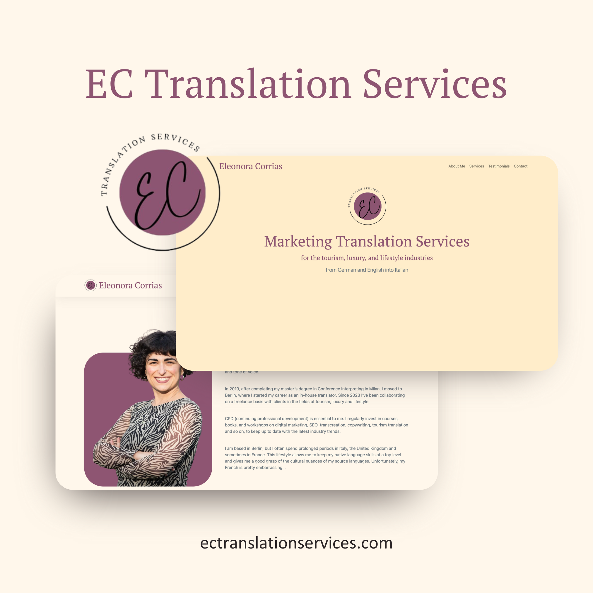
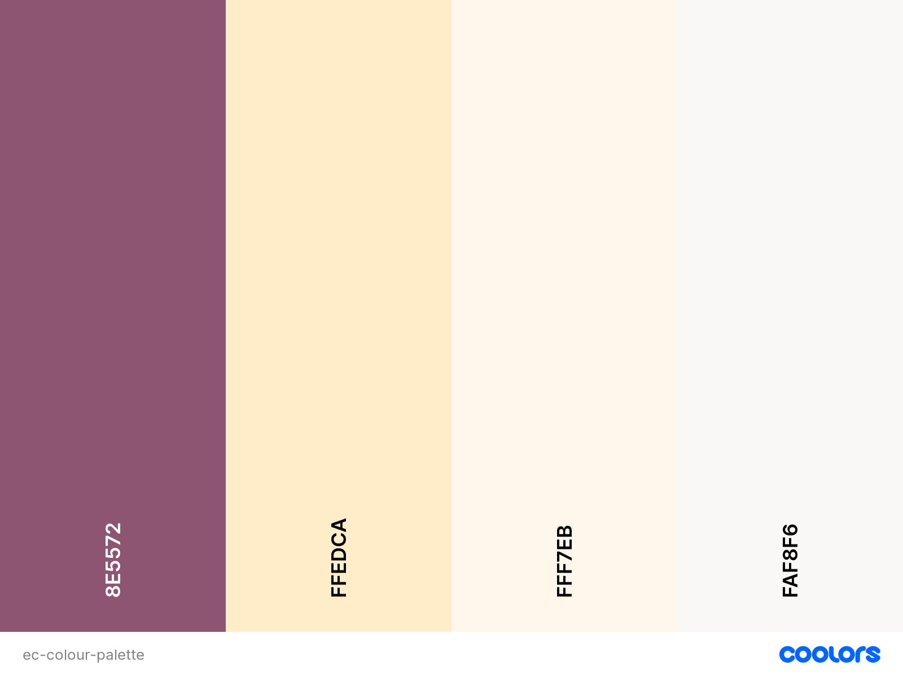
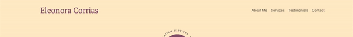
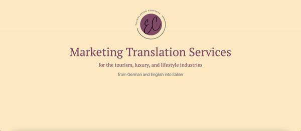
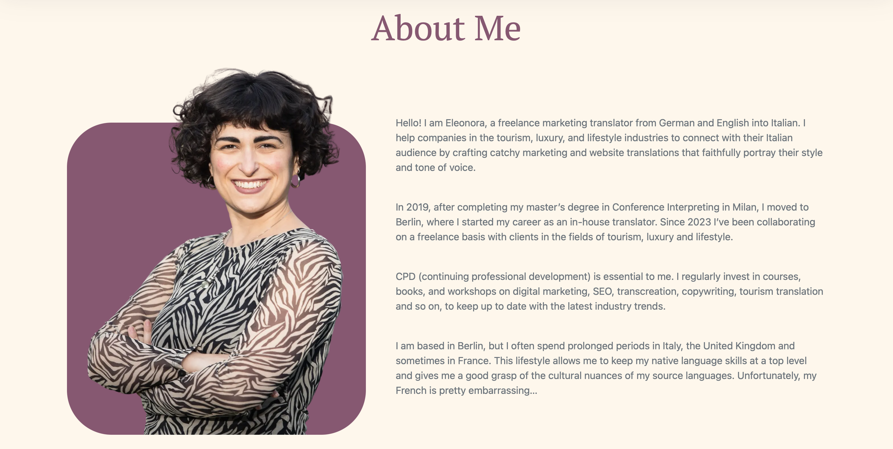
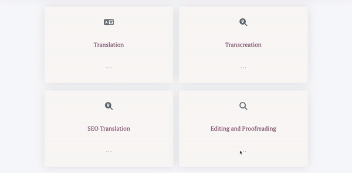
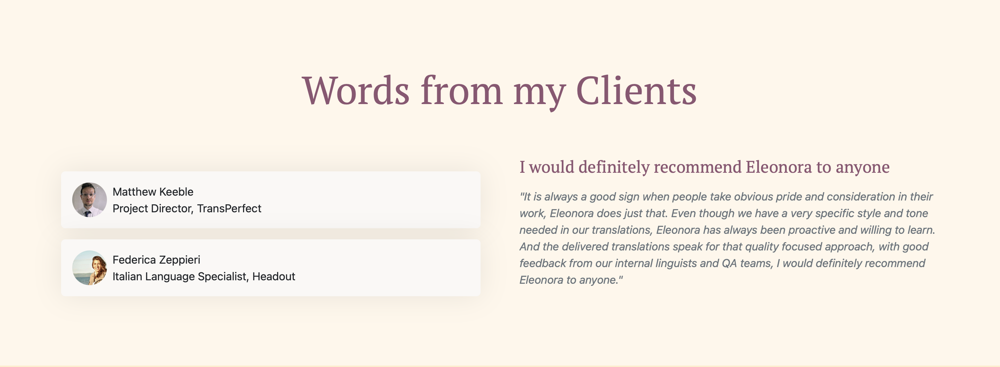
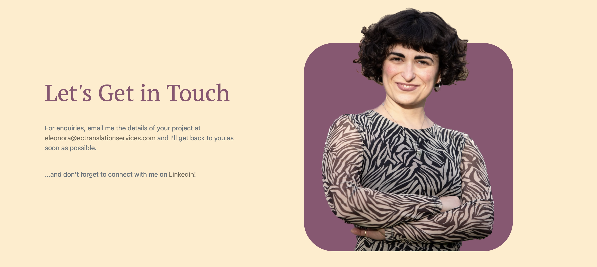
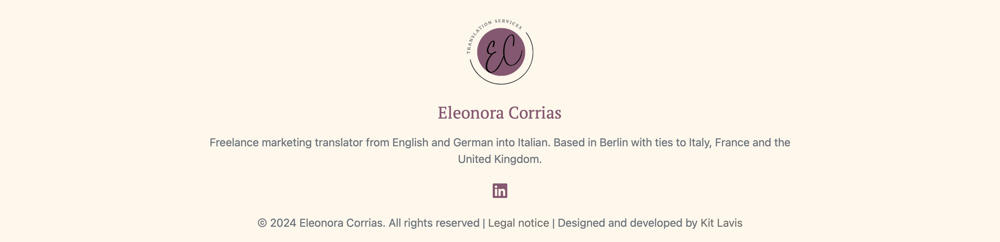

# EC Translation Services

This website was designed and built for my client Eleonora Corrias, a freelance Italian marketing translator.

The scope was to create a simple yet eye-catching page to that she can send to potential clients, to clearly explain the services she offers.

[Deployed Site](https://ectranslationservices.com)

## Design

- The nature of the client's work called for a font style with a classic feel, so PT Serif was used as the header font.

- Colourwise it was decided that a minimal off-white set would be used, accented by magenta.

## Features

The page is a simple "one-pager" that consists of a navbar, five sections (hero, about, services, testimonials and contacts) and a footer.

### Navbar

The navbar is a dynamic element that is fixed to the top of the page, with internal links that when clicked jump to the relevant section. As the user scrolls, the background colour changes and box shadow is added to give a 3D effect. A "top" link and the client's logo are also added on scroll.

### Hero

The hero section consists of the client's logo and a short sentence to immediately tell the user what it is the client does. These elements are dynamic, flying in from bottom and coming into focus on load.

### About

The about section consists of a photgraph of the client and a brief description of her education and working life up to the present day.

### Services

The service section contains four cards, each representing a different service the client offers. These use CSS animations to "flip" on mouse over, revealing a description of the service on the front of the card.

### Testimonials

The testimonials section contains clickable icons based off of a bootstrap accordion, which reveal a short review from companies/people that our client has worked with.

### Contact

The contact section is similar to the about section, consisting of a photograph of our client and the method of contacting them.

### Footer

Finally the footer contains our client's logo, a brief description, links to their LinkedIn page and our page, as well as a link to their Impressum, a requirement for all businesses in the client's country of residence.

## Tools and Tech

- HTML
- CSS with Bootstrap 5
- JavaScript

## Credits

### Code

- [Service cards](https://bootsnipp.com/snippets/92xNm)
- [Testimonial accordion](https://bbbootstrap.com/snippets/bootstrap-vertical-collapsible-testimonials-41662708)

### Media

- Screen records were captured with Omi Screen Recorder
- Screen records were converted to gifs using ezgif.com
- Canva was used to create the mockup at the top of this document
- Coolors.io was used to create the colour palette
